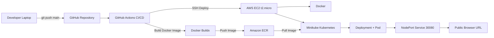

# Deploying a Node.js Web Application on AWS Free Tier Using Docker & Kubernetes with CI/CD Pipeline

**Student Name:** Hassan Zahid  
**Roll Number:** [Your Roll Number]  
**Course:** DevOps / Cloud Computing  
**Submission Date:** [Date]  
**Public Application URL:** `http://[EC2_PUBLIC_IP]:30080`  
**GitHub Repository:** [Paste GitHub Repo Link]  
**Demo Video:** [Paste YouTube/Drive Link]

---

## 1. Introduction

This project demonstrates a complete DevOps workflow for deploying a Node.js web application using Docker, Amazon ECR, Kubernetes through Minikube, and GitHub Actions CI/CD. The goal is to understand how modern software is packaged, stored, deployed, and updated automatically.

Containers solve the common problem of “it works on my machine” by packaging the application with its runtime dependencies. Kubernetes helps manage container deployment, service exposure, health checks, and scaling. CI/CD automates the process so that every push to the main branch can build a new Docker image, push it to Amazon ECR, and redeploy the application on EC2 Minikube.

---

## 2. Architecture Diagram



---

## 3. Step-by-Step Implementation

### Phase 1: Node.js Web Application

I created a Node.js Express application that displays a timestamp, container ID, visitor counter, app version, and student name. I also added `/health` and `/api/info` routes for testing and monitoring.

### Phase 2: Docker Containerization

A `Dockerfile` was created using `node:20-alpine`. The image installs only production dependencies and exposes port 3000.

### Phase 3: Amazon ECR

I created an Amazon ECR private repository and pushed the Docker image using AWS CLI authentication.

### Phase 4: EC2 Free Tier Instance

I launched an Ubuntu EC2 t2.micro instance using AWS Free Tier. The security group allowed SSH port 22 and application NodePort 30080.

### Phase 5: Docker, kubectl, Minikube, AWS CLI on EC2

I connected to the EC2 instance through SSH and installed Docker, kubectl, Minikube, and AWS CLI.

### Phase 6: EC2 Authentication to ECR

The EC2 instance authenticated to Amazon ECR using AWS CLI so Kubernetes could pull the image from the registry.

### Phase 7: Kubernetes Deployment

I deployed the app using Kubernetes Deployment and NodePort Service YAML. The app became publicly accessible at `http://[EC2_PUBLIC_IP]:30080`.

### Phase 8: CI/CD Pipeline

GitHub Actions was configured to automatically build, push, and deploy the application whenever code is pushed to the main branch.

### Phase 9: Testing and Verification

I verified the deployment using:

```bash
kubectl get pods
kubectl get services
curl http://localhost:30080/health
```

### Phase 10: Cleanup

After the demo, I stopped or terminated unused AWS resources to avoid accidental cost.

---

## 4. CI/CD Pipeline Design

The GitHub Actions workflow is triggered on push to the `main` branch and can also be triggered manually using `workflow_dispatch`.

Pipeline jobs:

1. Checkout source code
2. Set up Docker Buildx
3. Configure AWS credentials
4. Login to Amazon ECR
5. Build Docker image
6. Push image to ECR with commit SHA and latest tags
7. SSH into EC2
8. Apply Kubernetes deployment
9. Wait for rollout status

Deployment strategy: the pipeline renders the Kubernetes YAML with the new image URI and applies it using `kubectl apply`. Kubernetes then rolls out the new container image.

Failure handling: if any build, push, SSH, or deployment command fails, GitHub Actions marks the workflow as failed. The existing Kubernetes deployment continues running until a successful new deployment is applied.

---

## 5. Secrets Management

| Secret Name | Purpose |
|---|---|
| `AWS_ACCESS_KEY_ID` | Allows GitHub Actions to authenticate with AWS |
| `AWS_SECRET_ACCESS_KEY` | Secret key for AWS authentication |
| `AWS_REGION` | AWS region where ECR and EC2 are created |
| `ECR_REPOSITORY` | ECR repository name |
| `EC2_HOST` | Public IP address of EC2 instance |
| `EC2_USERNAME` | SSH username, usually `ubuntu` |
| `EC2_SSH_PRIVATE_KEY` | Private SSH key used by GitHub Actions to connect to EC2 |

These values are stored as GitHub repository secrets so they are not exposed in code.

---

## 6. Challenges Faced

### Challenge 1: Docker Permission Issue on EC2

After installing Docker, the `docker` command required sudo. I solved it by adding the user to the docker group and logging in again.

### Challenge 2: NodePort Not Opening Publicly

The app worked inside EC2 but not from the browser. The issue was the EC2 security group. I fixed it by adding inbound rule Custom TCP port 30080.

### Challenge 3: ECR Authentication Failed

Docker could not pull from ECR because EC2 was not authenticated. I fixed it using AWS CLI `get-login-password` and Docker login.

### Challenge 4: CI/CD SSH Deployment Failed

The GitHub Actions SSH step failed because the private key formatting was incorrect. I fixed it by pasting the complete private key in GitHub Secrets including BEGIN and END lines.

---

## 7. Cost Analysis

| Service | Free Tier / Free Usage | Cost |
|---|---:|---:|
| EC2 t2.micro | AWS Free Tier eligible | $0 |
| Amazon ECR | Small Docker image storage within free usage | $0 |
| Docker | Free community usage | $0 |
| Minikube | Open-source and free | $0 |
| Kubernetes | Running locally through Minikube | $0 |
| GitHub Actions | Free minutes for public repositories | $0 |
| GitHub Repository | Public repository | $0 |

Total project cost: **$0**, if resources remain within free tier and unused resources are cleaned up after demonstration.

---

## 8. Screenshots

Add screenshots with captions:

1. Node.js app running locally
2. Docker image build success
3. Amazon ECR repository image
4. EC2 instance running
5. SSH connection to EC2
6. Minikube status
7. Kubernetes pods running
8. Kubernetes service NodePort
9. Browser public URL
10. GitHub Actions successful workflow
11. CI/CD update after code change
12. Cleanup or EC2 termination screen

---

## 9. Conclusion and Learnings

Through this project, I learned how a real DevOps pipeline works from development to deployment. I understood how Docker packages an application, how Amazon ECR stores container images, how Kubernetes deploys and exposes applications, and how GitHub Actions automates the build and deployment process. I also learned practical cloud skills such as EC2 setup, security groups, SSH access, Minikube setup, ECR authentication, and cost-safe cleanup.

---

## Appendix: GitHub Actions Workflow YAML

Paste the complete `.github/workflows/deploy.yml` file here.
